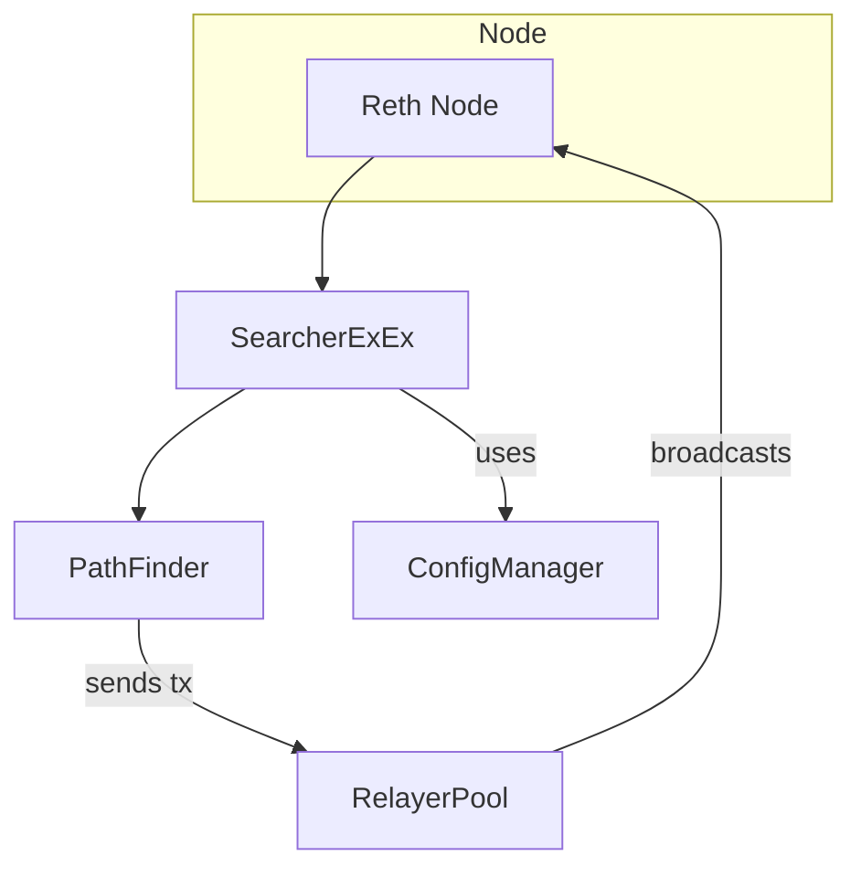

# Searcher Reth

This repository contains a set of crates that build a searcher on top of the
[Reth](https://github.com/paradigmxyz/reth) client.  Each crate has a focused
responsibility which is summarized below.

## Crates

| Crate | Role |
|-------|------|
| **bin/searcher-reth** | Binary that launches Reth with the searcher extension installed. |
| **crates/config** | Loading and managing configuration files and candidate data. |
| **crates/core** | Fundamental traits and constants shared across strategies. |
| **crates/strategy** | Implementation of searcher strategies (e.g. path finding). |
| **crates/extension** | Glue code that runs inside Reth's ExEx framework and handles relaying transactions. |
| **crates/util** | Utilities such as logging setup and signal handling. |

## Flow

The binary starts a Reth node and installs `SearcherExEx`. The extension loads
configuration via `ConfigManager`, finds profitable routes with `PathFinder` and
submits transactions through `RelayerPool`.
