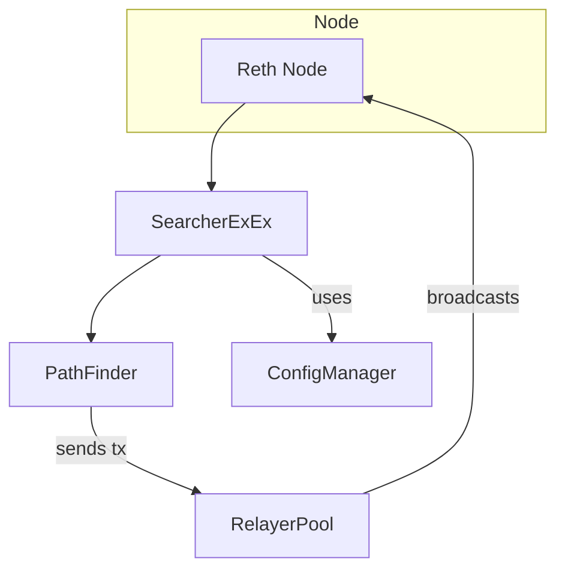

# Searcher Reth

This repository contains a set of crates that build a searcher on top of the
[Reth](https://github.com/paradigmxyz/reth) client.  Each crate has a focused
responsibility which is summarized below.

## Crates

| Crate | Role |
|-------|------|
| **bin/searcher-reth** | Binary that launches Reth with the searcher extension installed. |
| **crates/manager** | Configuration loading and signal handling utilities. |
| **crates/strategy** | Strategy implementations and core traits. |
| **crates/extension** | Glue code that runs inside Reth's ExEx framework and handles relaying transactions. |

## Flow



The binary starts a Reth node and installs `SearcherExEx`. The extension loads
configuration via `ConfigManager`, finds profitable routes with `PathFinder` and
submits transactions through `RelayerPool`.

## Telegram Notifications

Profits detected by `PathFinder` are batched at a configurable interval (default
10 minutes) and sent to a Telegram chat. To enable this feature:

1. Create a Telegram bot using [@BotFather](https://t.me/BotFather) and obtain
   the bot token.
2. Determine the chat ID to which the bot should send messages. Sending a message
   to the bot and calling `getUpdates` on the Bot API is one way to retrieve it.
3. Add a `[telegram]` section to your `env.toml`:

```toml
[telegram]
bot_token = "<your bot token>"
chat_id = "<target chat id>"
report_interval_secs = 600
```

When configured, each batch of profit information is also stored locally as
`profits_TIMESTAMP.json`.
