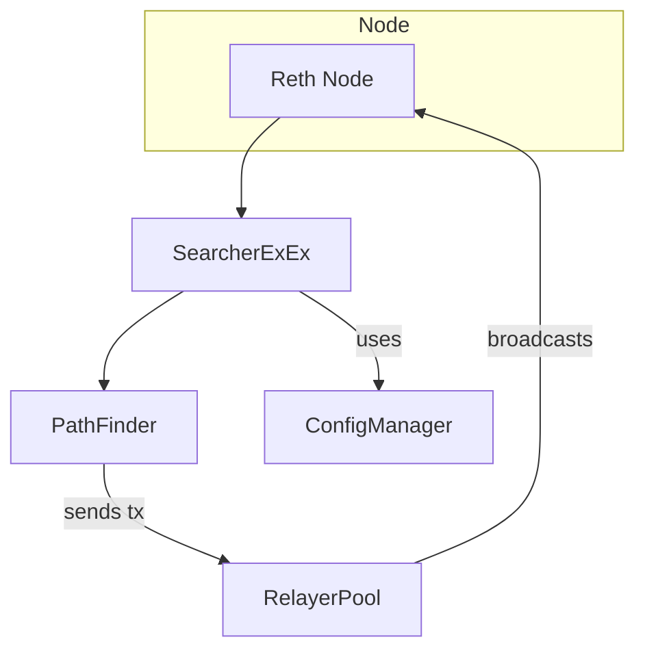

# Searcher Reth

This repository contains a set of crates that build a searcher on top of the
[Reth](https://github.com/paradigmxyz/reth) client.  Each crate has a focused
responsibility which is summarized below.

## Crates

| Crate | Role |
|-------|------|
| **bin/searcher-reth** | Binary that launches Reth with the searcher extension installed. |
| **crates/config** | Loading and managing configuration files and candidate data. |
| **crates/core** | Fundamental traits and constants shared across strategies. |
| **crates/strategy** | Implementation of searcher strategies (e.g. path finding). |
| **crates/extension** | Glue code that runs inside Reth's ExEx framework and handles relaying transactions. |
| **crates/util** | Utilities such as logging setup and signal handling. |

## Flow



The binary starts a Reth node and installs `SearcherExEx`. The extension loads
configuration via `ConfigManager`, finds profitable routes with `PathFinder` and
submits transactions through `RelayerPool`.

## Logging

The logging utilities write JSON logs to the directory set in the `LOG_DIR`
environment variable. When running the binaries you can place the logs in
`/var/log` so that they are discoverable by the shipper:

```bash
# example: run the searcher and write logs to /var/log/searcher-reth
LOG_DIR=/var/log/searcher-reth cargo run --bin searcher-reth
```

`deployments/docker-compose.yml` defines a lightweight [Vector](https://vector.dev/)
Logtail agent that forwards these log files to
[Better Stack](https://betterstack.com/). Launch it with your ingestion token:

```bash
cd deployments
BETTER_STACK_TOKEN=your-token docker compose up -d
```

The agent uses `etc/vector.toml` to read `/var/log/searcher-reth/*.log` and
`/var/log/searcher-tx-relayer/*.log` before posting them to Better Stack. After
logs are ingested you can configure real-time alerts based on tags or patterns
in the Better Stack dashboard.

